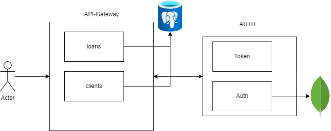
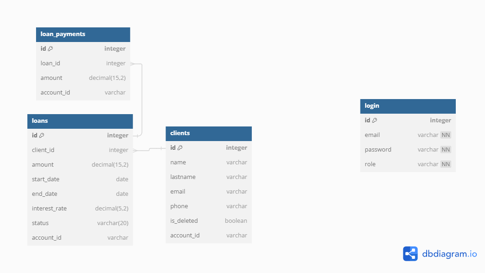

# BACKEND TEST

## Project Description

This is a test project simulating a system with clients and loans per user, providing basic CRUD endpoints for these functionalities.

Database Diagram

## System Diagram

### Authentication

This project includes its own authentication microservice located in auth-service. This microservice is not intended to be directly exposed to clients but for internal consumption. Thus, the main project api-gateway accesses this server.

Auth-service utilizes JWT mechanism with refresh tokens. It generates refresh tokens with minimal information and short-lived access tokens to be used for all operations. Additionally, it employs RSA as an encryption algorithm, allowing sharing the public key with other servers for token validation. In case the public key cannot be added to a server, Auth-service provides an endpoint to validate tokens.

### API-Gateway

This is the main server with its own migrations to create the database and add sample records.

Domain-Driven Design patterns are followed, hence modules are structured with repositories, services, controllers, models, and for loans, a store, as it contains two models within its domain: loans and loan-payments.

Under static, public keys are stored to validate auth tokens generated by Auth-service.

Providers are singletons managing the database connection and connection to other servers, in this case, Auth-service.

Alembic contains migrations that create tables and populate them with some test data.

Lib contains a base_repository abstracting all basic and common operations in any other repository.

## Installation

### Requirements

Python
Docker
Node.js
Execution with docker-compose
In the auth-service and api-gateway folders, run docker-compose up in each. This will create the default containers, auth-service on port 3000 and api-gateway on port 5000.

### Usage

This project features multiple endpoints. All endpoints and environment variables can be imported into Postman using the collection provided in the postman folder, along with its environment variables.
